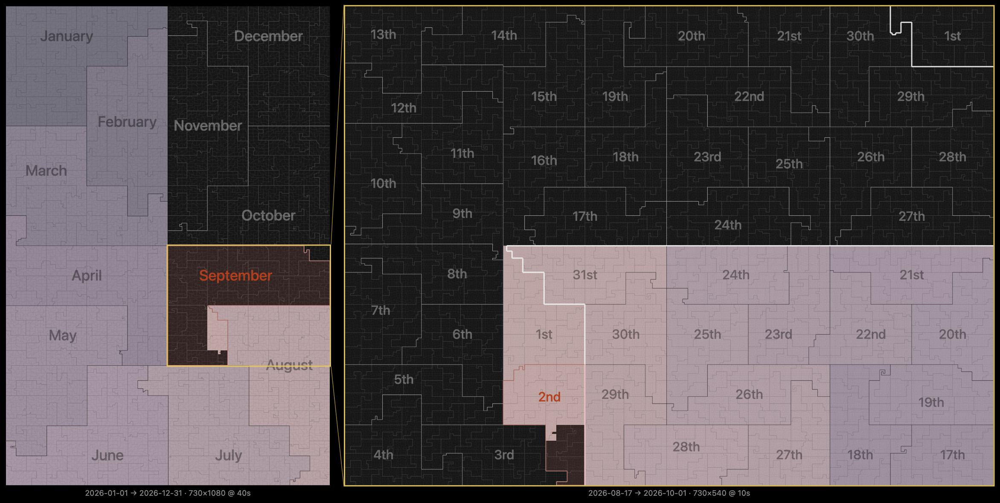

# Hilbert Clock

[](https://nebelmesser.com/hilbert/clock.html)

A clock that draws a time range as a 2D space-filling curve.
[Open the live map](https://nebelmesser.com/hilbert/clock.html)
or the built `hilbert/clock.html`. Source lives in `hilbert/app/` (TypeScript +
Vite, same layout as `4d/app/`). Behaviour is specified in
[`requirements.md`](requirements.md).

Time runs along a generalized Hilbert curve ("gilbert", so non-power-of-two
grids work too), one cell per time step. Cells that are consecutive in time stay
adjacent on screen, so an interval always shows up as a compact blob rather than
a scattered set of pixels.

## Inspiration

[](https://www.youtube.com/watch?v=3s7h2MHQtxc)

## Ranges

`D` / `M` / `Y` are the current day, month and year and follow the wall clock
(they roll over at midnight). `Unix` is 0 … 2038-01-19, the signed 32-bit epoch,
which is exactly 2³¹ seconds and therefore lands on a clean square grid.
`Range` opens two date inputs for a custom interval; when a custom range ends,
it advances to the next window of the same length.

The grid (`w × h` and the duration of one cell) is picked per range by a scoring
pass that balances the aspect ratio of the available space, the number of cells,
leftover cells, and whether a parent cell can still be refined down to ≤ 1 s.

## Zoom

A second panel refines one block of the parent map: the yellow box marks a
Hilbert-tree leaf around *now*, diagonals connect it to the inset, and each
parent cell inside it is subdivided into `k × k` sub-cells so the inset can get
down to sub-second resolution. `+` and `−` step through tree depths, i.e. pick a
bigger or smaller yellow box. On the day view, zooming out past the coarsest
step dismisses the inset and leaves a single panel.

Both panels are laid out to fit the viewport without scrolling — side by side or
stacked, whichever gives more map area (portrait always stacks).

## Keyboard

| Key | Action |
| --- | --- |
| `D` `M` `Y` `U` | day / month / year / Unix epoch |
| `+` `−` or `↑` `↓` | zoom in / out |
| `F` or double click/tap | hide the top bar |

### Notes

- The selected range, custom dates and zoom level per range are kept in
  `localStorage`.
- `?time=YYYY-MM-DD-HH:MM:SS` starts the clock at a given moment (it keeps
  ticking from there) — handy for screenshots and debugging.
- `?speedup=X` speeds up rendering X times
- All colors and most tunables are CSS custom properties in `:root`
  (`hilbert/app/src/style.css`); the app reads them, so retheming means
  editing the stylesheet only.
- Range is selected with the **Range** button (there is no `R` shortcut).

## Develop

```
cd hilbert/app
npm install
npm run dev      # http://localhost:5173/clock.html
npm test
npm run build    # writes ../clock.html and ../assets/clock.{js,css}
```

## License

MIT. Made by [Nebelmesser](https://nebelmesser.com/).
